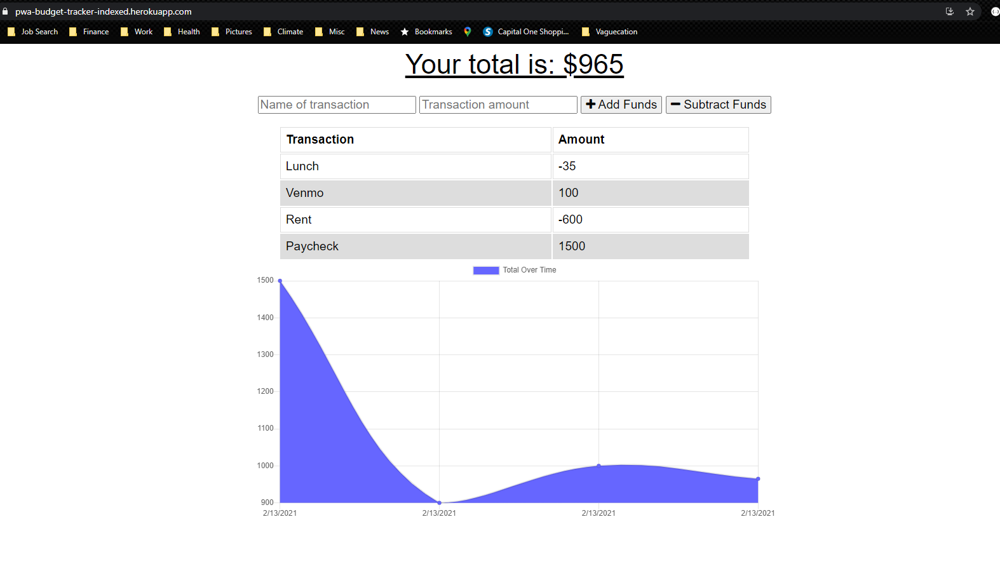

# Project: PWA-Online-Offline-Budget-Tracker

  Deployed Site Link - > https://pwa-budget-tracker-indexed.herokuapp.com/

## Table of Contents: 
- [Project: PWA-Online-Offline-Budget-Tracker](#project-pwa-online-offline-budget-tracker)
  - [Table of Contents:](#table-of-contents)
  - [License:](#license)
  - [Description:](#description)
  - [Installation Instructions:](#installation-instructions)
  - [Test Command:](#test-command)
  - [Github:](#github)
  - [My Email Address:](#my-email-address)
  - [Other Contributors:](#other-contributors)
  - [Images:](#images)

## License:

## Description:
Add functionality to a Budget Tracker application to allow for offline access and functionality.

The user will be able to add expenses and deposits to their budget with or without a connection. When entering transactions offline, they should populate the total when brought back online.

Offline Functionality:

  * Enter deposits offline

  * Enter expenses offline

When brought back online:

  * Offline entries should be added to tracker.

In this project we use a MongoDB database with a Mongoose schema and handle routes with Express to provide the user with a functional app.

User Story - 
GIVEN a user is on Budget App without an internet connection
WHEN the user inputs a withdrawal or deposit
THEN that will be shown on the page, and added to their transaction history when their connection is back online.

## Installation Instructions: 
1) npm i on server.js

## Test Command: 
To test offline functionality open dev tools and go to the network tab. Change from Online to Offline and refresh page. Then add a transaction and refresh again. Change back to Online from Offline and refresh for the last time. 

## Github: 
Check out more projects on my Github at https://github.com/ReindeerCode

## My Email Address:
If you have any questions please feel free to email me at ReindeerCode@gmail.com

## Other Contributors:
Collaborated with https://github.com/arensalmela

## Images:

Following screen shot is of the Dashboard screen

